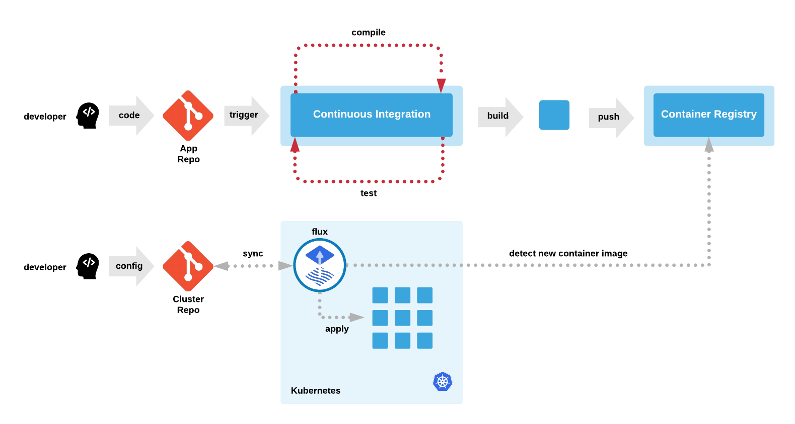

# GitOps with Kubernetes Guide - Beginner-Friendly


source: [QA platform](https://www.qa.com/)

## Table of Contents
1. [What is GitOps?](#what-is-gitops)
2. [Key Concepts](#key-concepts)
3. [GitOps Architecture](#gitops-architecture)
4. [Prerequisites](#prerequisites)
5. [Step-by-Step Setup](#step-by-step-setup)
6. [Understanding the Workflow](#understanding-the-workflow)
7. [Monitoring and Management](#monitoring-and-management)
8. [Troubleshooting](#troubleshooting)
9. [Best Practices](#best-practices)
10. [Cleanup](#cleanup)

## What is GitOps?

GitOps is a modern approach to continuous deployment that uses Git as the single source of truth for declarative infrastructure and application configurations. Think of it as "Git as the control plane" for your Kubernetes deployments.

### Traditional vs GitOps Deployment

**Traditional Deployment:**
- Developers push code to CI/CD pipeline
- Pipeline builds, tests, and directly deploys to Kubernetes
- Manual intervention often required
- No single source of truth

**GitOps Deployment:**
- Developers commit application manifests to Git
- GitOps operator continuously monitors Git repository
- Automatically applies changes to match Git state
- Git becomes the single source of truth

### Benefits of GitOps

1. **Declarative**: Everything is described as code in Git
2. **Versioned**: Git provides complete audit trail
3. **Automated**: No manual deployments
4. **Recoverable**: Easy rollback using Git history
5. **Secure**: Pull-based deployment (no external access to cluster)

## Key Concepts

### Essential Components

- **Git Repository**: Stores your Kubernetes manifests
- **GitOps Operator**: Monitors Git and applies changes (FluxCD in our case)
- **Kubernetes Cluster**: Target environment for deployments
- **Source Controller**: Manages Git repository connections
- **Kustomize Controller**: Applies Kubernetes manifests

### FluxCD Components

- **Source Controller**: Handles Git repositories, Helm repositories, and S3 buckets
- **Kustomize Controller**: Applies Kustomize configurations
- **Helm Controller**: Manages Helm releases
- **Notification Controller**: Sends alerts and notifications
- **Image Automation Controller**: Updates container images automatically
- **Image Reflector Controller**: Scans container registries

## GitOps Architecture

```mermaid
graph TB
  Developer[👨‍💻 Developer] --> Git[📚 Git Repository<br/>gitops-manifests]
  Git --> GitRepository[🔗 GitRepository<br/>Resource]
  GitRepository --> SourceController[📥 Source Controller<br/>Monitors Git]
  SourceController --> KustomizeController[⚙️ Kustomize Controller<br/>Applies Manifests]
  KustomizeController --> K8sCluster[☸️ Kubernetes Cluster<br/>Applications Running]

  subgraph "FluxCD Components"
      SourceController
      KustomizeController
      HelmController[🎛️ Helm Controller]
      NotificationController[📢 Notification Controller]
  end

  subgraph "Git Repository Structure"
      GitManifests[📁 manifests/<br/>├── nginx-deployment.yaml<br/>├── service.yaml<br/>└── configmap.yaml]
  end

  subgraph "Kubernetes Cluster"
      FluxNamespace[🏠 flux namespace<br/>FluxCD Controllers]
      GitOpsNamespace[🏠 gitops-app namespace<br/>Your Applications]
  end

  Git -.-> GitManifests
  K8sCluster -.-> FluxNamespace
  K8sCluster -.-> GitOpsNamespace

  style Git fill:#e1f5fe
  style K8sCluster fill:#e8f5e8
  style SourceController fill:#fff3e0
  style KustomizeController fill:#fff3e0
```



## GitOps Workflow


## Prerequisites

Before starting, ensure you have:

- **Kubernetes cluster** (e.g., Minikube, kind, or cloud provider) - Kind is used in this example
- **kubectl** installed and configured to access your cluster
- **Helm 3** installed (package manager for Kubernetes)
- **Git repository** to store your Kubernetes manifests (GitHub, GitLab, Bitbucket)
- **Basic understanding** of Kubernetes concepts (pods, deployments, services)

### Verify Prerequisites

```bash
# Check Kubernetes cluster
kubectl cluster-info

# Check Helm version (should be 3.x)
helm version

# Check kubectl access
kubectl get nodes
```

## Step-by-Step Setup

### 1. Install FluxCD v2

FluxCD v2 is a complete rewrite of the original Flux, designed as a set of specialized controllers that work together.

#### Add FluxCD Helm Repository

```bash
# Add the official FluxCD community Helm repository
helm repo add fluxcd-community https://fluxcd-community.github.io/helm-charts

# Update your local Helm chart repository cache
helm repo update
```

#### Create Namespaces

Kubernetes namespaces provide isolation between different applications and components.

```bash
# Create namespace for FluxCD controllers
kubectl create namespace flux

# Create namespace for your GitOps applications
kubectl create namespace gitops-app
```
[Create k8 namespace](images/k8-ns.png)

**Why separate namespaces?**
- `flux`: Contains FluxCD controllers and configuration
- `gitops-app`: Contains your actual applications managed by GitOps

#### Install FluxCD Controllers

```bash
# Install FluxCD v2 using Helm
helm install flux fluxcd-community/flux2 --namespace flux
```
[Install flux](images/install-flux.png)

#### Verify Installation
```bash
# Check if all FluxCD pods are running
kubectl get pods -n flux
```
[Verify flux pods](images/flux-pods.png)

You should see the following controllers running:
- **helm-controller**: Manages Helm releases
- **image-automation-controller**: Automates image updates
- **image-reflector-controller**: Scans container registries
- **kustomize-controller**: Applies Kustomize configurations
- **notification-controller**: Sends alerts and notifications
- **source-controller**: Manages Git repositories and other sources

### 2. Create and Configure Git Repository

#### Create Git Repository

1. Go to GitHub, GitLab, or Bitbucket
2. Create a new repository named `gitops-manifests`
3. Initialize with a README (optional)
4. Make note of the repository URL

#### Clone Repository

```bash
# Clone your repository to local machine
git clone <repository-url>
cd gitops-manifests
```

### 3. Configure Git Access for FluxCD

FluxCD needs access to your Git repository to monitor changes. For private repositories, SSH keys are recommended.

#### Create SSH Key Pair

```bash
# Generate SSH key pair specifically for FluxCD
ssh-keygen -t rsa -b 4096 -f ~/.ssh/flux -N ""
```

This creates:
- `~/.ssh/flux`: Private key (keep secret)
- `~/.ssh/flux.pub`: Public key (add to Git repository)

#### Prepare Known Hosts

```bash
# Create known hosts file to avoid SSH prompts
ssh-keyscan github.com > ~/.ssh/known_hosts_github
```

#### Create Kubernetes Secret

```bash
# Create secret containing SSH private key and known hosts
kubectl create secret generic flux-ssh \
  --from-file=identity=$HOME/.ssh/flux \
  --from-file=known_hosts=$HOME/.ssh/known_hosts_github \
  --namespace flux
```

#### Add Deploy Key to Repository

```bash
# Display public key
cat ~/.ssh/flux.pub
```

1. Copy the public key output
2. Go to your repository → Settings → Deploy keys
3. Click "Add deploy key"
4. Paste the public key
5. Give it a title (e.g., "FluxCD Deploy Key")
6. Check "Allow write access" if you want FluxCD to update images automatically

### 4. Create GitRepository Resource

The GitRepository resource tells FluxCD where to find your manifests.

Create a file named `gitrepository.yaml`:

```yaml
apiVersion: source.toolkit.fluxcd.io/v1
kind: GitRepository
metadata:
  name: gitops-manifests
  namespace: flux
spec:
  interval: 1m                    # Check for changes every minute
  url: ssh://git@github.com/Caesarsage/gitops-manifests # Replace with your repository URL
  ref:
    branch: main                  # Monitor main branch
  secretRef:
    name: flux-ssh               # Use SSH secret for authentication
```

**For public repositories**, use HTTPS instead:

```yaml
apiVersion: source.toolkit.fluxcd.io/v1
kind: GitRepository
metadata:
  name: gitops-manifests
  namespace: flux
spec:
  interval: 1m
  url: https://github.com/Caesarsage/gitops-manifests
  ref:
    branch: main
  # No secretRef needed for public repos
```

#### Apply GitRepository Resource

```bash
# Apply the GitRepository configuration
kubectl apply -f gitrepository.yaml
```

#### Verify Secret and GitRepository

```bash
# Verify the secret was created correctly
kubectl describe secret flux-ssh -n flux

# Check if GitRepository is ready
kubectl get gitrepository gitops-manifests -n flux -w
```

The status should change from `False` to `True` once authentication is configured properly.


**Understanding the output:**
- **URL**: Git repository being monitored
- **AGE**: How long the resource has existed
- **READY**: Whether FluxCD can access the repository
- **STATUS**: Detailed status information

### 5. Create Kustomization Resource

The Kustomization resource tells FluxCD what to do with the manifests it finds in Git.

Create a file named `kustomization.yaml`:

```yaml
apiVersion: kustomize.toolkit.fluxcd.io/v1
kind: Kustomization
metadata:
  name: gitops-apps
  namespace: flux
spec:
  interval: 10m                   # Reconcile every 10 minutes
  path: ./manifests              # Look for manifests in this directory
  prune: true                    # Remove resources deleted from Git
  sourceRef:
    kind: GitRepository
    name: gitops-manifests       # Reference to GitRepository resource
    namespace: flux
  targetNamespace: gitops-app    # Deploy applications to this namespace
  timeout: 2m                    # Timeout for operations
```

**Key Configuration Explained:**
- **interval**: How often to check for drift and reconcile
- **path**: Directory in Git repository containing manifests
- **prune**: Automatically delete resources removed from Git
- **targetNamespace**: Where to deploy the applications

#### Apply Kustomization Resource

```bash
# Apply the Kustomization configuration
kubectl apply -f kustomization.yaml
```

### 6. Deploy Your Applications

Now it's time to create some applications for GitOps to manage.

#### Create Directory Structure

```bash
# Create manifests directory in your Git repository
mkdir -p manifests
```

#### Create Sample Application

Create `manifests/nginx-deployment.yaml`:

```yaml
# Nginx Deployment
apiVersion: apps/v1
kind: Deployment
metadata:
  name: nginx-app
  namespace: gitops-app
  labels:
    app: nginx-app
spec:
  replicas: 2                    # Run 2 copies for high availability
  selector:
    matchLabels:
      app: nginx-app
  template:
    metadata:
      labels:
        app: nginx-app
    spec:
      containers:
        - name: nginx
          image: nginx:1.21      # Specific version for consistency
          ports:
            - containerPort: 80
          resources:             # Resource limits for good practice
            limits:
              cpu: 100m
              memory: 128Mi
            requests:
              cpu: 50m
              memory: 64Mi
---
# Nginx Service
apiVersion: v1
kind: Service
metadata:
  name: nginx-service
  namespace: gitops-app
spec:
  selector:
    app: nginx-app             # Connect to pods with this label
  ports:
    - protocol: TCP
      port: 80                 # Service port
      targetPort: 80           # Container port
  type: ClusterIP             # Internal service only
```

#### Commit and Push Changes

```bash
# Add all files to Git
git add .

# Commit with descriptive message
git commit -m "Add nginx deployment manifest"

# Push to remote repository
git push origin main
```

### 7. Verify the Deployment

#### Check GitOps Resources

```bash
# Check GitRepository status (should be Ready: True)
kubectl get gitrepository gitops-manifests -n flux

# Check Kustomization status (should be Ready: True)
kubectl get kustomization gitops-apps -n flux
```

#### Verify Application Deployment

```bash
# Check pods in gitops-app namespace
kubectl get pods -n gitops-app

# Check services
kubectl get services -n gitops-app

# Check deployments
kubectl get deployments -n gitops-app
```


**Understanding the output:**
- **READY**: Number of ready pods vs desired replicas
- **UP-TO-DATE**: Pods with latest configuration
- **AVAILABLE**: Pods ready to serve traffic

## Understanding the Workflow

### The GitOps Loop


### What Happens When You Make Changes?

1. **Developer Action**: You modify a YAML file and push to Git
2. **Git Update**: Repository receives the new commit
3. **Source Controller**: Detects changes within the polling interval (1 minute)
4. **Kustomize Controller**: Downloads updated manifests
5. **Kubernetes API**: Applies changes to achieve desired state
6. **Reconciliation**: Continuously ensures cluster matches Git state

### Example: Scaling Your Application

Let's scale the nginx deployment from 2 to 3 replicas:

1. **Edit the manifest**:
   ```yaml
   spec:
     replicas: 3  # Changed from 2 to 3
   ```

2. **Commit and push**:
   ```bash
   git add manifests/nginx-deployment.yaml
   git commit -m "Scale nginx to 3 replicas"
   git push origin main
   ```

3. **FluxCD automatically**:
   - Detects the change within 1 minute
   - Updates the deployment in Kubernetes
   - Ensures 3 pods are running

## Monitoring and Management

### Check FluxCD Resources

```bash
# View all FluxCD resources
kubectl get all -n flux

# Check specific controller logs
kubectl logs -n flux deployment/source-controller
kubectl logs -n flux deployment/kustomize-controller
```

### Using FluxCD CLI (Optional)

If you install the Flux CLI, you get additional commands:

```bash
# Install Flux CLI (example for macOS)
brew install fluxcd/tap/flux

# Check git sources
flux get sources git

# Check kustomizations
flux get kustomizations

# Get overall status
flux get all

# Force reconciliation
flux reconcile source git gitops-manifests
flux reconcile kustomization gitops-apps
```

### Monitor Your Applications

```bash
# Watch your applications
kubectl get pods -n gitops-app -w

# Check deployment status
kubectl rollout status deployment/nginx-app -n gitops-app

# View application logs
kubectl logs -l app=nginx-app -n gitops-app
```

### Understanding FluxCD Events

```bash
# View FluxCD events
kubectl get events -n flux --sort-by='.lastTimestamp'

# Describe resources for detailed information
kubectl describe gitrepository gitops-manifests -n flux
kubectl describe kustomization gitops-apps -n flux
```

## Troubleshooting

### Common Issues and Solutions

These are some common issues you might encounter while setting up or using GitOps with FluxCD, along with their solutions. I experienced these issues during my setup, so I hope this helps you avoid them.

#### 1. GitRepository Not Ready For SSH Authentication

**Symptoms:**
```
NAME               READY   STATUS
gitops-manifests   False   failed to configure authentication
```

**Solutions:**
- Verify SSH key is added to repository as deploy key
- Check secret contains both `identity` and `known_hosts`
- Ensure repository URL is correct (ssh:// vs https://)

#### 2. Kustomization Path Not Found

**Symptoms:**
```
kustomization path not found: stat /tmp/xxx/manifests: no such file or directory
```

**Solutions:**
- Verify `manifests` directory exists in your Git repository
- Check the `path` field in your Kustomization resource
- Ensure files are committed and pushed to Git

#### 3. RBAC Permission Issues

**Symptoms:**
```
cannot create resource "deployments" in API group "apps"
```

**Solutions:**
- FluxCD should have appropriate cluster permissions
- Check if target namespace exists
- Verify Kustomization `targetNamespace` is correct

#### 4. Image Pull Errors

**Symptoms:**
```
Failed to pull image: unauthorized or not found
```

**Solutions:**
- Verify image name and tag are correct
- Check if registry requires authentication
- Ensure image exists in the specified registry

### Debugging Commands

```bash
# Check FluxCD controller status
kubectl get pods -n flux

# View detailed resource information
kubectl describe gitrepository gitops-manifests -n flux
kubectl describe kustomization gitops-apps -n flux

# Check events for issues
kubectl get events -n flux --sort-by='.lastTimestamp'
kubectl get events -n gitops-app --sort-by='.lastTimestamp'

# View controller logs
kubectl logs -n flux -l app=source-controller
kubectl logs -n flux -l app=kustomize-controller
```

## Best Practices

### 1. Repository Structure

Organize your manifests clearly:

```
gitops-manifests/
├── README.md
├── manifests/
│   ├── base/                 # Base configurations
│   │   ├── deployment.yaml
│   │   ├── service.yaml
│   │   └── kustomization.yaml
│   ├── staging/              # Environment-specific overlays
│   │   ├── kustomization.yaml
│   │   └── patches/
│   └── production/
│       ├── kustomization.yaml
│       └── patches/
└── clusters/
    ├── staging/
    └── production/
```

### 2. Environment Separation

Use different approaches for different environments:

**Option A: Branch-based separation**
- `main` branch for production
- `staging` branch for staging
- `development` branch for development

**Option B: Directory-based separation**
- `/production/` directory for production manifests
- `/staging/` directory for staging manifests
- Different Kustomization resources for each environment

### 3. Secret Management

Never store secrets in Git. Use tools like:
- **Sealed Secrets**: Encrypt secrets that can only be decrypted in-cluster
- **External Secrets Operator**: Fetch secrets from external systems
- **SOPS**: Encrypt files with various key management systems

### 4. Resource Management

Always specify resource limits:

```yaml
resources:
  limits:
    cpu: 500m
    memory: 512Mi
  requests:
    cpu: 100m
    memory: 128Mi
```

### 5. Health Checks

Add health checks to your applications:

```yaml
livenessProbe:
  httpGet:
    path: /health
    port: 8080
  initialDelaySeconds: 30
  periodSeconds: 10
readinessProbe:
  httpGet:
    path: /ready
    port: 8080
  initialDelaySeconds: 5
  periodSeconds: 5
```

### 6. Monitoring and Alerting

Set up monitoring for:
- FluxCD controller health
- Git repository synchronization status
- Application deployment success
- Resource utilization

### 7. Backup Strategy

Regular backups of:
- Git repository (use Git hosting provider's backup features)
- Kubernetes cluster state
- FluxCD configuration

## Cleanup

When you're ready to remove everything:

```bash
# Delete GitOps applications
kubectl delete kustomization gitops-apps -n flux
kubectl delete gitrepository gitops-manifests -n flux

# Uninstall FluxCD
helm uninstall flux -n flux

# Delete namespaces (this removes everything in them)
kubectl delete namespace flux
kubectl delete namespace gitops-app

# Remove SSH keys (optional)
rm ~/.ssh/flux ~/.ssh/flux.pub ~/.ssh/known_hosts_github
```

## Conclusion

GitOps with FluxCD provides a robust, scalable way to manage Kubernetes deployments. Key takeaways:

1. **Git is the source of truth** - All changes go through Git
2. **Declarative approach** - Describe desired state, let FluxCD achieve it
3. **Continuous reconciliation** - FluxCD constantly ensures cluster matches Git
4. **Security** - Pull-based model, no external cluster access needed
5. **Auditability** - Complete history through Git commits

Start simple with basic deployments and gradually adopt advanced features like image automation and multi-tenancy as your needs grow.

Remember: GitOps is not just a tool, it's a methodology. The key is maintaining discipline in keeping Git as your single source of truth for all infrastructure and application configurations.

